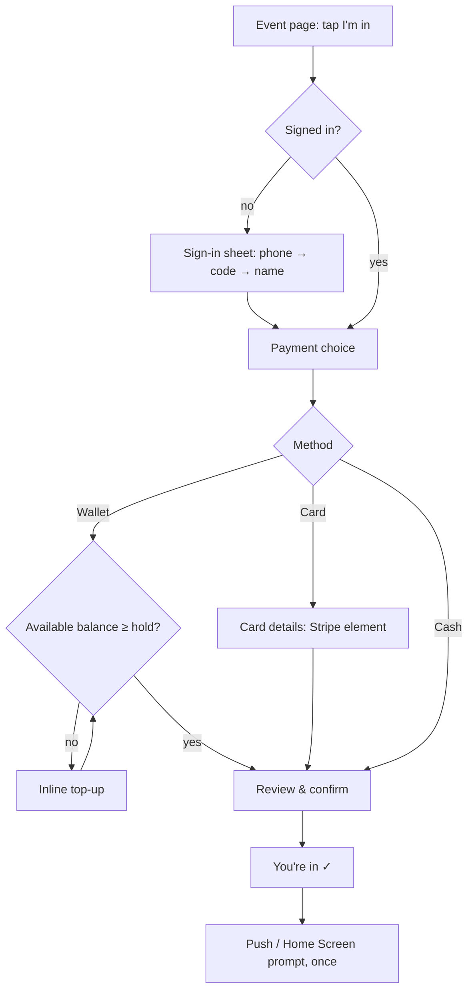

# RSVP Manager — MVP UI/UX Spec

Companion to [`feature-spec-mvp.md`](./feature-spec-mvp.md). That file says **what the system does**; this one says **what each screen contains, what people can do on it, and how the flows move between screens**. Visual design lives in the Figma design system and its code twin, the UI kit ([`src/components/ui`](../src/components/ui/README.md), live at `/design`); see [§15](#15-visual-design-and-components). Section references like "§3" point to the feature spec.

Status: first draft. Gaps found in the feature spec while writing this are collected in [Open questions](#open-questions).

---

## 1. Who uses it, and how

### People

| Who | Arrives from | Device | What they want | How often |
|---|---|---|---|---|
| **Player, first time** | Event link in a WhatsApp group | Phone, often inside WhatsApp's in-app browser | "Is it on, how much, who's going? Put me in." In under a minute. | Once |
| **Regular player** | WhatsApp link, push notification, or Home Screen icon | Phone | Check status, drop out before confirmation, see what they were charged, top up wallet. | Weekly |
| **Organizer** | Home / group page | Phone for day-to-day (often at the pitch); desktop sometimes for set-up and reconciliation | Post the next game fast, see who's in, confirm, chase who owes, fix money after the game. | Weekly, bursts around game day |

Organizers are also players (§ Assumptions: min/max includes the organizer if they RSVP). Every organizer screen must also work as a player screen.

### Usage assumptions that shape the UI

- **Mobile first, one hand.** Design at 360–390px wide. Primary actions sit in the bottom third of the screen (sticky bottom bar). Desktop is a wider layout of the same screens, not a separate product (§12).
- **The event link is the front door.** Most sessions start on `/e/{slug}` with no account and no context. That page must explain itself.
- **In-app browsers.** WhatsApp/Instagram/Messenger webviews may not share cookies with the real browser and may drop the session. Sign-in must be cheap to repeat (SMS code, autofill) and never lose what the person was doing.
- **Short attention, real money.** Every screen that touches money states the amount, the fee, and *when* it will be charged, before the tap that commits to it.
- **Glanceable status.** The two questions asked most are "is it on?" and "am I in / have I paid?". Both are answered at the top of the event page without scrolling.

### UX principles

1. **One primary action per screen.** Secondary actions go in an overflow menu or lower down.
2. **Defer sign-in until it's needed.** Viewing never asks for a phone number. Sign-in happens inside the RSVP flow and returns to the same step.
3. **Say the rule in plain words, every time it matters.** "Free to drop out until the game is confirmed. After that you're paying, and a refund is up to the organizer." (§3) Never make people learn the word "cut-off".
4. **Show consequences before irreversible actions.** Confirm, cancel event, refund, and joining a confirmed event get a summary sheet that lists exactly who is affected and what money moves.
5. **Never a dead end.** Full → waitlist. Wallet too low → top up inline. Card failed → pay link. Event over → link to the group's next game.
6. **Status never by colour alone.** Every chip has a text label (accessibility, and sunlight on a phone screen at the pitch).

---

## 2. Information architecture

### Routes

| Route | Screen | Access |
|---|---|---|
| `/e/{slug}` | Event page (§4) | Public; personalised when signed in |
| `/g/{slug}` | Group page (§5) | Public; personalised when signed in |
| `/` | Home: my games and groups (§6). Signed out: short landing + "Create a group". | Public / signed in |
| `/sign-in` | Sign-in (standalone fallback; usually shown as a sheet) (§3) | Public |
| `/wallet` | Wallet (§8) | Signed in |
| `/wallet/top-up` | Top-up (§8.2) | Signed in |
| `/me` | Account and notification settings (§9) | Signed in |
| `/pay/{token}` | Pay what you owe (§7.6) | Link from SMS/push; sign-in required to pay |
| `/groups/new` | Create group (§10.1) | Signed in |
| `/g/{slug}/edit` | Edit group (§10.2) | Group organizer |
| `/g/{slug}/events/new` | Create event, optionally `?from={eventSlug}` to duplicate (§10.3) | Group organizer |
| `/e/{slug}/edit` | Edit event (§10.4) | Group organizer |
| `/e/{slug}/manage` | Organizer event list (§10.5) | Group organizer |
| `/payouts` | Payouts and Stripe onboarding (§10.8) | Organizers |

### Navigation

- **Signed out, landed from a link:** no tab bar. A slim header with the app name (links to `/`) and a "Sign in" text button. Nothing competes with the event.
- **Signed in, mobile:** bottom tab bar with 3 tabs: **Games** (`/`), **Wallet** (`/wallet`), **Me** (`/me`). Groups are reached from Games. Organizer tools live inside group and event pages, not in a separate tab, so organizers and players see the same structure.
- **Signed in, desktop (≥1024px):** the same three destinations as a top nav bar.
- Event and group pages always show a back affordance to the parent group (event → group → Games).
- Hide the wallet tab entirely if the wallet is feature-flagged off (it's blocked on the legal check, feature spec open question 1). Every wallet mention in this doc assumes it's on; with it off, payment choice is card / cash only.

### Shared UI patterns

- **Bottom sheet (mobile) / centred dialog (desktop)** for every multi-step flow started from a page: RSVP, sign-in, cancel, confirm, refund, add walk-in. The page stays underneath so closing the sheet returns to context.
- **Sticky action bar** at the bottom of the event page and forms, holding the primary CTA and one line of context ("Nothing charged now").
- **Toasts** for completed low-risk actions ("Marked as paid outside app" with **Undo** for 5s where the action is reversible record-keeping).
- **Skeletons** while loading; never a blank page on a slow 3G connection at a sports hall.
- **Pull to refresh** on event, manage, and Games screens; data also refreshes on window focus (people switch back from WhatsApp).
- **Share button** uses the native share sheet (`navigator.share`), falling back to "Copy link" + "Share to WhatsApp".

---

## 3. Sign-in (phone + SMS code)

Only triggered by an action that needs identity: RSVP, join waitlist, join group, claim a spot, pay, top up, anything organizer. Shown as a sheet over the current page; on completion the original action continues where it left off.

**Step 1 — Phone number**
- Country code selector, default **+353** (Ireland), then number field (`type="tel"`, `autocomplete="tel"`).
- Helper: "We'll text you a code. Your number is only shown to organizers of groups you join." *(confirm privacy line, see open questions)*
- CTA: **Send code**. Disabled until the number parses as valid.

**Step 2 — Code**
- 6-digit field, `autocomplete="one-time-code"`, numeric keypad; use WebOTP where available so Android fills it automatically. Auto-submits on the 6th digit.
- "Sent to +353 87 … 123 · **Change**".
- **Resend code** enabled after 30s, with a countdown. After 3 resends: "Having trouble? Try again in 10 minutes."
- Wrong code: inline error, field cleared, keeps focus.

**Step 3 — Name (first time only)**
- First name, last name. Helper: "Others will see you as **Aoife M.**" with live preview (first name + last initial, §4).
- CTA: **Continue**.

Then the original action resumes (e.g. the RSVP sheet opens on the payment step).

Edge cases
- Session lost in an in-app browser → the next protected action simply shows the sheet again; no error page.
- Number already registered on another device → just signs in; no "account exists" branch.

---

## 4. Event page `/e/{slug}` (the most important screen)

This is where almost everyone lands. It must answer, in this order: **what/when/where → is it on → how much → who's in → what do I do.**

### 4.1 Sections, top to bottom

1. **Header**
   - Group name (link to `/g/{slug}`), event title.
   - **Event status chip**: Open · Confirmed · Cancelled · Didn't go ahead (Expired) · Finished (start time passed).
   - Share button (top right). Organizer also sees **Manage** (primary for them) and an overflow menu: Edit, Repeat this game, Cancel event.
2. **Your status banner** (only if signed in and involved), e.g.
   - "You're in · €10.00 held from wallet · drop out free until Wed 19:00"
   - "You're in · €8.50 charged to card ending 4242"
   - "You're in · paying €8.00 cash on the day"
   - "You're on the waitlist · #2 · auto-join with wallet"
   - "You dropped out · €8.50 paid" (after confirmation; becomes "€8.00 refunded" if the organizer refunds)
   - "You owe €8.50 · **Pay now**" (failed card, §5)
   - Links to the relevant action (Change payment, Can't make it, Pay now).
3. **Key facts**
   - Date and time: "Thu 25 Sep · 19:00–20:30" plus relative ("in 2 days"). **Add to calendar** (.ics download / Google link) once the person is in.
   - Location: text, tappable → opens the maps app with the address.
4. **Is it on? block** — the §3 rule in context, changing with state:
   - Open, before cut-off, auto-charge on: "**Confirms Wed 24 Sep, 19:00 if 6 or more are in.** Until then you can drop out for free."
   - Open, auto-charge off: "**The organizer will confirm this game.** You can drop out for free until they do."
   - Open, cut-off passed, min not met: "**Not confirmed yet** — needs 2 more. You can still drop out for free."
   - Confirmed: "**Game on.** Confirmed Wed 19:00. Joining now charges you straight away. If you drop out after that, a refund is up to the organizer."
   - Open, cut-off passed, organizer alerted (§10.9): same as "Not confirmed yet"; players aren't told the organizer is deciding.
   - Cancelled: "Cancelled by the organizer. All online payments refunded in full, including fees." + optional organizer message.
   - Expired: "This game didn't go ahead. Nobody was charged."
5. **Headcount**
   - Progress bar with a marker at min and the end at max: "**8 in** · needs 6 · 12 max" → "4 spots left". With no max: "8 in · needs 6 · no limit".
   - Waitlist count if any: "3 on the waitlist".
6. **Price**
   - Fixed: "**€8.00** each".
   - Split, before confirmation: "**€6.67–€10.00** each" (or "**Up to €10.00** each" with no max) + "Court costs €80, split between everyone who plays. The more who join, the less each pays. Final price is set when the game confirms." (§2)
   - After confirmation: "**€8.00** each (locked)".
   - Fee line underneath, small: "+ €0.50 service fee by card · no fee with wallet or cash" (only list the methods this event accepts).
   - **Cost breakdown** (collapsible, if provided): "Court booking — €80".
7. **Who's in**
   - List of "Aoife M." names in join order, organizer tagged "Organizer". Show first ~12, then "Show all 18". Walk-ins aren't shown publicly (they're organizer records).
   - Waitlist names shown in a collapsed section "Waitlist (3)" in waitlist order.
   - No payment information about other people is ever shown to players.
8. **Description** (free text, links auto-linked, collapsed after ~5 lines with "More").
9. **Footer**: "Organized by Conor B. in Thursday Basketball Galway" → group link. If the event is over: "Next game: Thu 2 Oct" link if one exists.

**Sticky action bar** (bottom): primary CTA + one line of context. See the matrix below.

### 4.2 Primary action by state

Viewer = what the signed-in (or anonymous) person is relative to this event.

| Event state → / Viewer ↓ | Open, spots left | Open, full | Confirmed, spots left | Confirmed, full | Started / finished | Cancelled / Expired |
|---|---|---|---|---|---|---|
| **Not in** (incl. anonymous) | **I'm in** · "Nothing charged now" | **Join waitlist** | **Join and pay €X** · "Charged now" | **Join waitlist** | No CTA; "Game has started" | No CTA; link to group |
| **Going** | **Can't make it** (secondary style) · status in banner | same | **Can't make it** (secondary style) · "No automatic refund" | same | "Game has started" | — |
| **Waitlist, auto-join** | — | **Leave waitlist** + switch mode | — | same | "Waitlist closed" | — |
| **Waitlist, notify-me, spot open** | **Claim spot** (primary, highlighted) | — | **Claim spot and pay €X** | — | — | — |
| **Owes** | — | — | **Pay €X now** | same | **Pay €X now** (until payout) | — |
| **Organizer** | Own player CTA as above + **Manage** in header | | | | **Mark attendance** shortcut after start | |

Notes
- "Open, full" for a *notify-me* waitlister whose spot hasn't opened: CTA is **Leave waitlist**, and a line "We'll notify you if a spot opens".
- "Can't make it" is one tap + confirm sheet (§7.4) in every state before start. Before confirmation the sheet says it's free; after confirmation it says clearly that there's no automatic refund.
- If state changes while the page is open (e.g. it fills up between viewing and tapping), the RSVP sheet re-checks on submit and offers the waitlist instead (§7.1 edge cases).

### 4.3 Freshness

- Refetch on focus and every 30s while visible (headcount and spots change fast before a game). No websockets needed for MVP.
- Show "Updated just now" only if a refresh changed the headcount, as a small subtle line.

### 4.4 Link previews

`/e/{slug}` must render Open Graph tags server-side so the WhatsApp preview says something useful: title "Thursday 5-a-side · Thu 25 Sep 19:00", description "8 in · 4 spots left · €8 each · Westside Sports Hall". Previews are cached by WhatsApp, so avoid anything that goes stale fast (spots left is acceptable; it's a hint).

---

## 5. Group page `/g/{slug}`

Purpose: the permanent link for a recurring game. Players bookmark it or pin it in the WhatsApp group description.

Sections
1. **Header**: group name, description (collapsible), member count ("24 members"), organizer name, **Share group link**.
2. **Membership CTA** (signed out or not a member): **Join group** · "Get notified when new games are posted." → sign-in if needed → joined toast + push prompt (§9.2). Members see a quiet "You're a member" label instead. (Leaving a group isn't in the feature spec; see open questions.)
3. **Upcoming games**: cards sorted by start time. Each card: date/time, title, status chip, "8/12 in", price (or range), and the viewer's own status chip if involved (Going / Waitlist #2 / Owes). Tap → event page.
4. **Past games**: collapsed list, last 10, same card in compact form.

Organizer additions
- **New game** (primary, sticky on mobile) and on each past/upcoming card an overflow: **Repeat this game**, **Manage**.
- **Edit group** in header overflow.
- Empty state for a new group: "No games yet. **Create the first game**" + share reminder.

---

## 6. Games (Home) `/`

Signed in. The "what do I need to know this week" screen.

1. **Needs your attention** (only rendered when non-empty), highest priority first:
   - "You owe €8.50 for Thu 5-a-side · **Pay**"
   - "A spot opened in Sat Padel · **Claim**"
   - Organizer: "Thu 5-a-side reached cut-off without enough players · **Review**" / "3 people owe for Tue Basketball · **Open**"
   - Organizer: "Set up payouts to receive online payments · **Continue**" (if onboarding incomplete and an online event exists)
2. **Your upcoming games**: cards like the group page, but only games the person is in or waitlisted for, with their personal status and payment (held / charged / cash / owes).
3. **Your groups**: list of groups (name, next game date). Organizer-run groups tagged "Organizer" and listed first. **Create a group** button at the end of the list.
4. **Past games** link → simple list of games attended with amount paid.

Empty state (signed in, nothing yet): "Your games will show up here. Got a link from your group? Open it to join. Running a game? **Create a group**."

Signed out `/`: one-screen landing: what it is in one sentence, **Create a group** (→ sign-in → §10.1), and "Got a link? Just open it." No marketing site in MVP.

---

## 7. Player flows

### 7.1 RSVP (join an event with spots left)

**Payment choice step** (sheet)
- Title: "How do you want to pay?"
- Option cards (radio), only those allowed for this event:
  - **Wallet** · "Balance €34.00" · "No service fee". Before confirmation: "We'll hold €10.00 until the game confirms" (split: upper bound, "any difference is released at confirmation"). After confirmation: "€8.00 paid now". If balance too low: card still selectable but shows "Top up needed" and choosing it opens top-up inline.
  - **Card** · "+ €0.50 service fee". Savings nudge (§5): "Save with wallet: €0.50 per game by card vs about €0.20–0.40 with a top-up. **Top up instead**." If the person already has a saved card, show "Visa ···· 4242" with "Use another card".
  - **Cash on the day** (only if the event accepts cash) · "Pay the organizer in person. No fee."
- Default selection: last method the person used; otherwise wallet if balance covers it, otherwise card.
- The first time someone sees the wallet option with a zero balance, it shows "Set up a wallet" rather than "Balance €0.00".

**Review & confirm step** (can be merged into the payment step when there's nothing extra to enter, e.g. wallet or cash)
- Summary: event, date, price line, fee line, total, and **when** it's charged:
  - Open: "**Nothing is charged now.** If the game confirms, you'll pay €8.50. You can drop out for free until then."
  - Confirmed: "**€8.50 will be charged now.** If you drop out later, a refund is up to the organizer."
- CTA copy states the consequence: **Join — nothing charged now** / **Join and pay €8.50**.
- Card on a confirmed event → PaymentIntent + 3D Secure in-flow; on an open event → SetupIntent ("Save card, charged only if the game confirms").

**Success**
- "You're in for Thu 5-a-side" + banner summary + **Add to calendar** + **Share with friends**.
- Once per device, after the first successful RSVP: notifications prompt (§9.2).

Edge cases
- Event filled while the sheet was open → "It just filled up. **Join the waitlist instead?**" keeping the chosen payment method.
- Event got confirmed while the sheet was open → price/fee/"charged now" copy is re-shown and must be re-accepted; never silently charge.
- Card declined / 3DS failed on a confirmed event → stay on the step with Stripe's message; nothing is saved until payment succeeds.
- Already going (double tap, second tab) → just show the event page with their status.

### 7.2 Join waitlist

Same sheet as RSVP, but the first step is choosing **how** to wait (§6):

- ◉ **Auto-join and pay** (default, listed first)
  - Copy: "If a spot opens, we'll put you in and pay for you automatically. Auto-join is served before notify-me."
  - Game open: "You'll be in like everyone else: free to drop out until the game confirms."
  - Game confirmed: "If you're moved in, you'll be charged €8.50 straight away."
  - Then the payment step, **wallet or card only**. Cash isn't offered, with the reason: "Cash can't be paid automatically. Choose *Notify me* to pay cash."
  - Card: saved now, nothing charged. Wallet: no hold yet; note "Keep at least €10.00 in your wallet, or we'll skip you and let you know."
- ○ **Notify me**
  - Copy: "We'll let you know when a spot opens. First to claim it gets it. You choose how to pay then (cash is fine)."
  - No payment step. This is the shortest path: one tap after sign-in.
- CTA: **Join waitlist** · "Nothing charged now".
- Success: "You're #3 on the waitlist" + chosen mode.

On the event page afterwards: position ("#3 · auto-join with card ···· 4242"), **Switch to notify me / auto-join** (keeps join time; switching to auto-join opens the payment step; position may change because auto-join entries come first, and the copy says so), **Leave waitlist**.

Auto-join, moved in: the person gets the "Moved in" notification (§9.3) and the page shows them as Going with the normal status banner.

### 7.3 Claim a spot (notify-me waitlist)

Triggered by the "Spot open" notification → deep link to the event page with the **Claim spot** CTA highlighted.
- Tap → the normal RSVP payment step (§7.1), including **cash** if the event allows it, with the usual charge copy → "You're in".
- Someone else got there first: "Someone just took that spot. You're still #1 on the waitlist." No error styling; it's expected behaviour.

### 7.4 Can't make it (drop out)

Available any time up to the event start (§3). One sheet, copy depends on state:

- **Before confirmation**: "Drop out of Thu 5-a-side? Nothing has been charged. Your €10.00 wallet hold is released." (card: "Your card won't be charged.") CTA **Drop out**.
- **After confirmation, paid online**: "Drop out of Thu 5-a-side? You've paid €8.50. **You won't get an automatic refund**; the organizer can still refund you. Your spot goes to the waitlist." CTA **Drop out anyway**.
- **After confirmation, cash**: "Drop out of Thu 5-a-side? Conor may still ask you to pay the €8.00." CTA **Drop out anyway**.
- Secondary: **Stay in**.
- Result: toast "You've dropped out". Before confirmation the page returns to the "Not in" state. After confirmation the banner shows "You dropped out · €8.50 paid", and "Refund issued" (§9.3) arrives only if the organizer refunds.
- Rejoining after dropping out is a normal new RSVP (and after confirmation, a new charge). The sheet mentions this if they had paid.

### 7.5 Change payment method (before confirmation)

From the status banner: **Change** → the payment choice step pre-filled. Holds are swapped (release old, place new). Not available after confirmation. *(Feature spec doesn't mention changing method; proposed as a small convenience, see open questions.)*

### 7.6 Pay what you owe `/pay/{token}`

Reached from the "Payment failed" SMS/push or the "You owe" banner.
- Shows event, date, amount owed and fee, reason ("Your card was declined on Wed 24 Sep").
- Payment choice: wallet (if balance covers it) or card. Cash isn't offered here (that's the organizer marking "paid outside app").
- Success: "Paid. Thanks!" and the organizer's list updates to paid online.
- If the organizer already marked it paid outside app: "Nothing to pay. Conor marked this as paid."
- Token links require sign-in as the same user; a different signed-in user sees "This payment link is for another account."

---

## 8. Wallet `/wallet`

### 8.1 Wallet home
- **Available balance** (large), and under it "€10.00 held for 1 upcoming game" (expandable list of holds: event, amount, "released or charged when the game confirms").
- Actions: **Top up** (primary), **Withdraw balance** (secondary/overflow).
- "Max balance €150" shown only when near the cap.
- **Activity** list, newest first: top-ups (amount + fee), game payments, holds released, refunds in, withdrawals. Each row: description, date, signed amount. Tap → detail (Stripe receipt link for card top-ups).
- Empty state explains the why in one line: "Top up once, pay for games with no service fee."

### 8.2 Top up
- Three amount chips: **€20 · €50 · €100** (§5). Each shows the total: "€20 + €1.00 fee = €21.00".
- Chips that would push the balance over €150 are disabled with the reason: "Would exceed the €150 max balance."
- Card entry (Stripe element / saved card / Apple Pay & Google Pay if available through Stripe).
- CTA **Pay €21.00**. Success returns to wherever top-up was started (e.g. back into the RSVP sheet with wallet now selectable).

### 8.3 Withdraw (refund balance)
- Shows the full available balance; held funds can't be withdrawn ("€10.00 is held for upcoming games").
- Full balance only in MVP ("refundable on request at full value", §5). Refunded to the original top-up card(s); copy: "Back on your card in 5–10 business days."
- Over €50: extra identity-check step (pending legal; design as a placeholder step that can be switched off).
- Confirm sheet → done state.

---

## 9. Me `/me` and notifications

### 9.1 Account
- Name (editable; preview of how others see it), phone number (read-only in MVP), **Sign out**.
- **Notifications**: status on this device ("Push notifications: On / Off / Not supported"), **Turn on**, and **Send test**. Explains the SMS fallback: "Important payment messages also come by SMS."
- Saved cards: list + remove *(not in feature spec; see open questions)*.
- Links: payouts (organizers), terms, privacy, help/contact.

### 9.2 Getting push permission
- Never ask on first load. Ask **after the first successful RSVP or group join**, with an in-app pre-prompt: "Get told when the game confirms or a spot opens?" → **Turn on** triggers the browser prompt / **Not now** (ask again after the next RSVP, max 3 times).
- **iPhone (not installed to Home Screen)**: push isn't possible, so the pre-prompt becomes an "Add to Home Screen" guide (Share → Add to Home Screen, with a small illustration), and notes "Otherwise we'll text you about payments."
- Android/desktop Chrome: offer "Install app" via the `beforeinstallprompt` event after the second visit.

### 9.3 Where each notification lands

Every notification deep-links to a screen already in the right state. No in-app notification inbox in MVP; Home's "Needs your attention" covers the actionable ones.

| Trigger (§9) | Message (example) | Opens |
|---|---|---|
| New event posted | "New game in Thursday Basketball: Thu 2 Oct 19:00" | Event page, **I'm in** CTA |
| Cut-off reminder | "Thu 5-a-side confirms tomorrow 19:00. 5/6 in so far." | Event page |
| Moved in from waitlist | "You're in for Thu 5-a-side (moved from the waitlist). €8.50 charged." / "…Drop out free until Wed 19:00." | Event page, status banner |
| Skipped (wallet too low) | "A spot opened but your wallet couldn't cover it. Top up to stay in line." | Wallet top-up, returns to event |
| Spot open (notify-me) | "A spot opened in Thu 5-a-side. First to claim gets it." | Event page, **Claim spot** |
| Removed by organizer | "Conor removed you from Thu 5-a-side." + refund outcome if paid | Event page |
| *Organizer:* cut-off passed, not confirmed | "Thu 5-a-side: 4 of 6 in at cut-off. Confirm anyway or cancel?" | Manage event, decision sheet (§10.9) |
| Confirmed + charged | "Game on! Thu 5-a-side confirmed. €8.50 charged." (cash: "Bring €8 cash.") | Event page |
| Details changed | "Thu 5-a-side moved to 20:00 at Westside Hall." (show what changed) | Event page, changed fields highlighted once |
| Cancelled + refund | "Thu 5-a-side was cancelled. €8.50 refunded to your card." | Event page (cancelled state) |
| Payment failed | "Your card was declined for Thu 5-a-side. Pay €8.50 here: …" | `/pay/{token}` |
| Refund issued | "Conor refunded €8.00 for Thu 5-a-side." | Event page |

---

## 10. Organizer screens and flows

### 10.1 Create group `/groups/new`
- Fields: **Name** (required, e.g. "Thursday Basketball Galway"), **Description** (optional, multiline; hint: "Where you play, level, anything people should know").
- Slug generated from the name, shown as a preview "app.com/g/thursday-basketball-galway" (not editable in MVP).
- CTA **Create group** → **Share screen**: the link, **Share to WhatsApp**, **Copy link**, tip "Pin this link in your WhatsApp group description." → **Create the first game**.

### 10.2 Edit group `/g/{slug}/edit`
Name and description. Slug doesn't change (links already shared).

### 10.3 Create event `/g/{slug}/events/new`

One scrolling form with sections (short enough on mobile; no multi-page wizard). Sticky bar: **Publish**.

**The date leads** (§15 explains the reasoning): the form starts with *When*, and once a date is chosen the rest defaults from the group's last game and re-anchors to the new date. A group that already has games opens on the next likely date (last game + 7 days, at the same time).

1. **When & where**: Date, start time, **end time** (required; defaults to start + the duration of this group's last game, or 1h30 for the first; must be after start; overnight end rolls to the next day), Location (defaults to the last game's).
2. **Title** and Description. The title is **suggested** from the date and the last game ("Thursday 5-a-side" on a Saturday date becomes "Saturday 5-a-side"; a title with no weekday gets one in front) and marked "Suggested". Changing the date moves the suggestion, but **once the organizer has typed a title it's never overwritten**. The same holds for every field: only fields the organizer hasn't touched follow the date.
   - **Same as your last game**: when a previous game exists, the details below (players, price, payment, cut-off) collapse into a summary card with a **Change details** button, so a repeat game is *pick a date → Publish*. A group's first game shows every field, empty.
3. **Players**: Min players (stepper, default 1, hint "Game only confirms automatically once this many are in"), Max players (stepper, optional, "No limit" toggle).
4. **Price**
   - Mode: segmented control **Fixed per person** / **Split the cost**.
   - Fixed: amount per person. Split: total cost.
   - Optional **Cost breakdown** rows ("Court booking — €80"), display only; hint when the sum doesn't match the total.
   - **Live preview** of what players will see: "Players pay €6.67–€10.00 each" (split) or "€8.00 each", plus "+ €0.50 fee by card; you receive the full price."
5. **How players pay** — single choice (§2):
   - **Cash + online** (default once payouts are set up)
   - **Online only** (wallet/card)
   - **Cash only** (default until payouts are set up)
   - If Stripe onboarding isn't finished, the two online options are shown but disabled with "Set up payouts to accept online payments · **Set up**" (§10.8). Setting up opens Stripe's onboarding and returns to this form with its values kept (local draft), with the online options now enabled.
   - Helper per option: Cash only → "Players pay you in person. No fees, no waitlist auto-join." Online only → "Players pay by wallet or card; you get paid out 2 days after the game." 
6. **Confirmation**
   - **Confirms on** (the cut-off): date/time picker, default **24h before start** (proposed default). Helper that restates the rule: "At this time, if at least 6 are in, the game confirms and online payers are charged. Before this, anyone can drop out for free."
   - **Auto-charge at cut-off** toggle (default on). Off helper: "You'll confirm it yourself. Nobody is charged until you do."
   - Validation: cut-off must be before start; warn if less than 2h before start.
7. **Review & publish**: a preview of the public event page card.
8. After publish → share screen (as §10.1) + "Group members are being notified."

**Repeat this game** (duplicate, `?from=`): same form, pre-filled with everything, date moved to +7 days (and cut-off moved by the same offset), status reset. Banner: "Copied from Thu 25 Sep. Check the date and price." Uses the current fee schedule (invisible to the organizer; §5).

### 10.4 Edit event `/e/{slug}/edit`
Same form, with constraints shown inline rather than as errors on submit:
- **Price** (fixed amount / split total) once anyone has RSVP'd: can only go down. Helper: "Can't be raised after people have joined. You can lower it." Increase attempts are blocked at input level.
- **Max lowered below current headcount**: inline warning listing who moves: "Seán K., Maria L. (the 2 most recent) will move to the front of the waitlist."
- **Pricing mode** can't change after the first RSVP *(assumption, see open questions)*.
- After confirmation: price fields locked ("Price locked at €8.00 when the game confirmed").
- On save, if date/time, location or price changed: confirm sheet "**12 people** (in + waitlist) will be notified about: time changed 19:00 → 20:00." CTA **Save and notify**.

### 10.5 Manage event `/e/{slug}/manage` (the organizer event list, §8)

One screen for everything about one event. Mobile: card list. Desktop: table (§12).

**One screen per phase.** What the screen shows and offers depends on where the game is, so each stage is minimal and useful for that stage. The phase is derived (never stored) by `eventPhase` in the events domain, and the server returns the allowed actions with the data (`eventActions` for the event, `actions` for each person), so the screen only renders them:

| Phase | Job | Primary | Supporting | ••• game menu |
|---|---|---|---|---|
| **Open** | Fill the game, decide when to lock it | Share game | Confirm now | Edit, Repeat, Add walk-in, View public page, Cancel |
| **Confirmed** | Fill the last spots, chase failed payments | Share game | — | Repeat, Add walk-in, View public page, Cancel |
| **Live** (started) | Collect cash, note no-shows | Add walk-in | — | Repeat, View public page |
| **Finished** | Reconcile | Repeat this game | — | View public page |
| **Cancelled / Expired** | — | Repeat this game | — | View public page |

While Open, **Confirm now** leads instead of Share once the cut-off has passed or auto-confirm is off — then confirming *is* the decision (§3, §10.9). Cancel exists only before the game starts and only in the menu, never next to a primary action. (Payout isn't modelled yet, so there's no separate "paid out" phase.)

**Top summary**
- Phase chip, title, date and place, headcount bar with the minimum marked ("7 in · needs 4 · 10 max · 5 spots left"; once the game has started: "6 came · 1 no-show"). Walk-ins count toward the minimum and the price split, not toward the maximum (§8).
- A banner that explains the phase: how it confirms (Open), "Everyone counts as showed" (Live), "it's your call" once the cut-off passes without confirmation (§10.9).
- *Money summary and payout status arrive with §5 (online payments).*

**Filters (chips)**, shown once the game is confirmed and only when someone is in them: All · Owes · Cash (or Cash to collect once started) · No-shows. Counts are on the chips.

**Person row — informational, no buttons.** One line under the name says where they stand, and how loudly:
- **red**: owes money, or was a no-show · **amber**: cash still to collect (once the game has started) · **grey**: everything fine (paid, held, cash on the day).
- Tags: *Dropped out*, *Walk-in*, *Organizer*, and "N past no-shows" for this group. Organizers see "First L." like everyone else *(full names: open question 4)*.
- Rows that need attention sort first; the list doesn't reorder otherwise.
- **Every change happens in the ••• menu, which opens from anywhere on the row.** The menu leads with the action that row most likely needs (bold), has a second line explaining anything with side effects, and puts destructive actions last. Which actions exist comes from `organizerRowActions`:
  - **Mark as paid** (owes or cash due; only once confirmed — before that nothing has been charged, and cash is collected on the day). Toast with Undo.
  - **Mark as no-show / Undo no-show** (only once the game has started, never on the organizer's own row). Toast with Undo.
  - **Message player** (WhatsApp link, when the person has a number).
  - **Remove from game** (**only before the game starts**; once it's running, someone who isn't there is a no-show). Opens a sheet stating what happens: their spot goes to the waitlist, and after confirmation their payment stays on record.
  - *Planned with §5:* Refund, and Send pay link again for failed cards.
- **Why menus, not buttons:** a button next to a name is easy to hit by mistake while standing at the pitch, and the common actions are reversible anyway (toast + Undo). Two taps for "mark paid" is the price; the whole row being tappable and the menu leading with the right action keep it cheap.

**Sections** in order: Going · Walk-ins · Waitlist (order, Auto-join / Notify-me tag and payment method; read-only in MVP) · **Dropped out**.

Dropped out: everyone who dropped out or was removed, each row tagged **Dropped out** with the time. If they paid, the payment is shown as clearly as on a Going row ("Paid online €8.50", "Cash due €8.00"), and the usual person-sheet actions apply (**Refund**, **Mark paid outside app**). Nothing prompts the organizer to act. The section is expanded when it contains anyone who paid, collapsed otherwise (only free, before-confirmation drop-outs).

### 10.6 Organizer money actions

**Confirm now** (sheet)
- "Confirm Thu 5-a-side?"
- What happens, as a list with real numbers: "Price locks at **€8.00** each (10 players, €80 split)" · "**7** online payers charged now" · "**2** paying cash on the day" · "**1** manual confirmation can't be undone."
- If min isn't met: warning "Only 4 of the minimum 6 are in." **Today the server refuses to confirm below the minimum** ("Minimum players not met"), so the button is disabled and the sheet says how to proceed (lower the minimum by editing the game). The spec's intent — "Confirm anyway", with the higher split price shown (§10.9, §3) — needs the `confirmEvent` rule relaxed; see [open question 9](#open-questions).
- CTA **Confirm and charge 7 people**. Result screen shows successes and any failed charges ("1 card failed — Seán K. now owes €8.50, pay link sent").

**Cancel event** (sheet)
- Open: "Cancel Thu 5-a-side? 10 people will be notified. Nothing has been charged; holds are released."
- Confirmed: "Cancel Thu 5-a-side? **€85.00 refunded to 10 people, including service fees.** 2 cash payers are just notified." Plus optional **message to players** ("Court flooded, sorry!").
- Destructive CTA **Cancel game**, requiring a second tap (or typing nothing — a two-step button is enough on mobile).

**Refund one person** (sheet)
- Amount: full price by default, "€8.00 back to their card/wallet. The €0.50 service fee isn't refunded." *(feature spec says the price is refunded in full; partial refunds aren't specified — the UI shows the amount as read-only in MVP)*
- CTA **Refund €8.00**.

**Refund all online-paid** (sheet)
- "Refund **€64.00** to 8 people who paid online? Service fees aren't refunded. Cash and paid-outside-app players aren't affected." Use case hint: "e.g. the game was shortened or you want to give everyone their money back without cancelling."
- CTA **Refund 8 people**.

**Add walk-in** (sheet)
- Name (free text), payment status: **Paid cash** / **Owes** / **Free**. Note: "Walk-ins don't count towards the max." CTA **Add**.

### 10.7 After the game (attendance and reconciliation)

**Everybody counts as having shown up unless the organizer marks them a no-show.** Attendance is an exception to record, not a task to complete: there's no "unmarked" state, no progress to finish, and nothing to do if everyone came (`attended: null` reads as showed; only `attended: false` is a no-show, and only that counts toward a player's no-show total).

The loop on the phone, during or right after the game:
1. Open the **Live** (or Finished) Manage screen. The banner says "Everyone counts as showed".
2. For anyone who didn't turn up: their ••• menu → **Mark as no-show** (toast with Undo). A no-show row turns red, and its menu leads with **Undo no-show**.
3. Filter **Cash to collect** → ••• → **Mark as paid** as cash is handed over.
4. Refunds if needed, before the payout date (arrives with §5).

### 10.8 Payouts `/payouts`
- **Stripe onboarding status**: Not started / In progress / Needs more info / Active. Primary CTA **Set up payouts** → Stripe-hosted onboarding → return URL back here (or back to the event being published).
- Explains: "Needed only for games that accept online payments. Cash-only games work without it."
- **Payout list**: per event — event, date, amount, status (Scheduled for Sat 27 Sep / Paid out / On hold), link to Stripe Express dashboard for bank details.

### 10.9 Game didn't reach its minimum

When cut-off passes without the minimum (auto-charge on), or cut-off passes with auto-charge off, the organizer is alerted (push + SMS fallback, and a Home "Needs your attention" item). The event stays Open for players.

Tapping the alert opens the manage screen with a **decision sheet**:
- "Thu 5-a-side has **4 of 6** players. What do you want to do?"
- **Confirm anyway** → the normal confirm sheet (§10.6), which shows the higher split price ("€20.00 each with 4 players").
- **Cancel game** → the normal cancel sheet (§10.6); nothing has been charged, so it's just notifications and hold releases. Optional message to players.
- **Wait** (dismiss) → stays Open; players can keep joining. Line: "If you don't decide, it'll expire 48h after the start time and nobody is charged." A reminder alert fires at start time if still undecided *(proposed)*.

---

## 11. Status vocabulary

One set of labels everywhere (chips, notifications, organizer list). Player-facing and organizer-facing labels differ where the internal term isn't meaningful to players.

**Event status** (`EventStatus`)

| Internal | Label | Notes |
|---|---|---|
| OPEN | Open | Plus sub-line: "Confirms Wed 19:00 if 6+" / "Waiting for organizer to confirm" |
| CONFIRMED | Confirmed / "Game on" | |
| CANCELLED | Cancelled | |
| EXPIRED | Didn't go ahead | Players never see "Expired". |
| (derived) start passed | Started / Finished | Display only; not a stored status. |

**Player payment status** (the organizer's list uses the §8 wording)

| Situation | Player sees | Organizer sees |
|---|---|---|
| Wallet hold, not confirmed | "€10.00 held" | Held |
| Card saved, not confirmed | "Card saved, not charged" | Held |
| Charged online | "€8.50 paid" | Paid online |
| Cash, not collected | "Pay €8.00 cash on the day" | Cash due (Owes) |
| Card failed | "You owe €8.50 · Pay now" | Owes |
| Marked by organizer | "Paid" | Paid outside app |
| Refunded | "€8.00 refunded" | Refunded |
| Dropped out | "You dropped out" + payment line above | "Dropped out" tag + payment chip above |

The current Prisma `PaymentStatus` enum (PENDING/HELD/CHARGED/OWES/REFUNDED) doesn't have "paid outside app" yet; they get added when §8 is built.

**Formatting**
- Money: "€8.00" always with cents in prices and totals; "€8" allowed only in casual copy like "Bring €8 cash". Fees always shown as a separate "+ €0.50 service fee" line before payment, and as the total on the CTA.
- Dates: "Thu 25 Sep · 19:00" (24h clock, Irish locale), relative time next to it where it helps ("in 2 days", "tomorrow"). Times are shown in the event's timezone.

---

## 12. Desktop and responsive behaviour

| | Mobile (<640px) | Tablet (640–1023px) | Desktop (≥1024px) |
|---|---|---|---|
| Nav | Bottom tab bar | Bottom tab bar | Top nav |
| Event page | Single column, sticky bottom CTA | Single column, max width ~640px | Two columns: details left; **sticky action card** right (price, status, CTA) |
| Sheets | Bottom sheets | Bottom sheets | Centred dialogs |
| Manage event | Card list, filters as scrollable chips | Card list | **Table**: name, no-shows, payment, amount, method, attendance, actions; bulk select for attendance |
| Forms | Single column | Single column | Single column, max width ~640px, with the live preview in a side column |

- No hover-only interactions; everything reachable by tap and keyboard.
- Keyboard: Enter submits sheets, Esc closes dialogs, focus trapped in dialogs and returned to the trigger on close.

---

## 13. Accessibility and resilience

- Tap targets ≥ 44×44px; attendance controls ≥ 48px (used quickly, standing up).
- Contrast AA minimum; outdoor use suggests going above it for status chips.
- Every chip has text; icons have labels; progress bar has an `aria-label` ("8 of 12 spots filled, minimum 6").
- Respect `prefers-reduced-motion` for sheet and success animations.
- Forms: labels always visible (no placeholder-only), errors next to the field and announced.
- **Slow/offline**: show cached last-known event data with "Offline — showing last update at 18:42". Money actions are disabled offline with an explanation; never queue payments.
- **Idempotency in the UI**: money CTAs disable and show progress on tap; a second tap does nothing. Results always shown explicitly (success or failure), never "something went wrong" alone for money — say whether money moved.

---

## 14. Screen inventory (for task tracking)

| # | Screen / sheet | Users | Feature spec |
|---|---|---|---|
| 1 | Event page (all states) | Everyone | §2, §3, §4, §7 |
| 2 | Sign-in sheet | Players | §4, Decision 1 |
| 3 | RSVP sheet: payment choice + review | Players | §4, §5 |
| 4 | Waitlist sheet (auto-join / notify-me) | Players | §6 |
| 5 | Can't make it sheet (before / after confirmation) | Players | §3, §4 |
| 6 | Pay what you owe | Players | §5 |
| 7 | Group page | Everyone | §1 |
| 8 | Games (Home) + signed-out landing | Everyone | — |
| 9 | Wallet, top-up, withdraw | Players | §5 |
| 10 | Me / notifications / push pre-prompt / Add to Home Screen guide | Players | §9 |
| 11 | Create / edit group + share screen | Organizers | §1 |
| 12 | Create / edit / repeat event | Organizers | §2 |
| 13 | Manage event (list, filters, person sheet) | Organizers | §8 |
| 14 | Confirm / cancel / refund / refund all / add walk-in / remove / min-not-met sheets | Organizers | §3, §7, §8 |
| 15 | Payouts + Stripe onboarding | Organizers | §5 |

Suggested build order, matching the "link in WhatsApp" core loop: 1 → 2 → 3 (cash + card only) → 5 → 11 → 12 → 13/14 (confirm, cancel, mark paid) → 7 → 8 → 4 → 6 → 9 → 10 → 15.

---

## Open questions

Resolved and folded into the feature spec: payment options per event (cash / online / both), waitlist modes (auto-join and pay vs notify me), dropping out after confirmation, organizer alert when the minimum isn't met, end time, "paid outside app" status (added to the schema when §8 is built).

Still open:

1. **Organizer removing a player.** §6 lists "the organizer removes someone" as a way a spot opens, but no flow existed for it. Proposal (drafted in §10.5 and feature spec §8): a **Remove from game** action on the person sheet, for when someone says in WhatsApp they can't come but doesn't drop out in the app, or a no-show regular needs to make room. Behaves exactly like the player dropping out: before confirmation → hold released, nothing charged; after confirmation → payment stays, they show as Dropped out, and the organizer can refund like anyone else. The player is notified and the spot goes to the waitlist. Questions: (a) is this in MVP? (b) can the organizer also remove people from the waitlist? (c) should the organizer be able to add an optional reason that the player sees?
2. **Changing payment method** before confirmation (§7.5) — allowed?
3. **Pricing mode changes after first RSVP** — assumed blocked; confirm.
4. **Privacy of names and phone numbers.** Players see "First L."; do organizers see full names and phone numbers of group members? (The manage screen proposes yes, for chasing payments.)
5. **Leaving a group / muting notifications** per group. Not in MVP spec; players will ask for it once "new event posted" pushes start.
6. **Saved cards management** in `/me` — needed for trust and for card removal requests.
7. **Partial refunds.** §8 says refund the price in full; organizers will want partial (e.g. game cut short). MVP = full only?
8. **Default cut-off.** Proposed 24h before start; the §9 cut-off reminder then fires ~48h before start. Confirm both.
9. **Confirming below the minimum.** §10.6/§10.9 say the organizer can "confirm anyway" (with a higher split price), but `confirmEvent` rejects a headcount below `minPlayers`, and the Manage screen follows the code for now (button disabled, with an explanation). Relax the rule, or drop "confirm anyway" from the spec?
10. **Bulk cash collection.** "Mark all cash as paid" would speed up game day but records money that hasn't been handed over; left out deliberately. Revisit if game-day taps prove too many.

---

## 15. Visual design and components

The look is **friendly and social**: warm sand surfaces, one coral accent, Nunito, rounded shapes, Light and Dark. It's defined once, in the Figma design system, and implemented once, in [`src/components/ui`](../src/components/ui/README.md) (live gallery at `/design`). Screens are composed from that kit and don't restyle it.

Principles the kit enforces (they're the ones in §1, made concrete):
- One primary action per screen, in the bottom third (`StickyActionBar`); everything else is secondary.
- Consequences before irreversible actions (`ConfirmSheet`); reversible actions get a toast with Undo (`useToast`).
- Status is a word first, colour second (`StatusChip`, `Banner`).
- Rows inform and menus act (`PersonManageRow`, `ActionMenu`).
- Tap targets ≥ 44px; sheets are native dialogs (focus trap, Esc); no hover-only behaviour.

**Sharing.** Every game and group has a share sheet: the link with a Copy button, a WhatsApp button, and the device's native share sheet when available, with a preview of what people will see in the chat. It opens from the share icon on the event and group pages, from "Share game" on Manage (the primary action while a game is Open or Confirmed), and automatically right after a group or game is created (§10.1, §10.3).

**Not built yet:** the bottom TabBar (component exists; Wallet and `/me` don't), and the wallet, top-up, `/me` and pay-link screens (§7.6, §8, §9).
